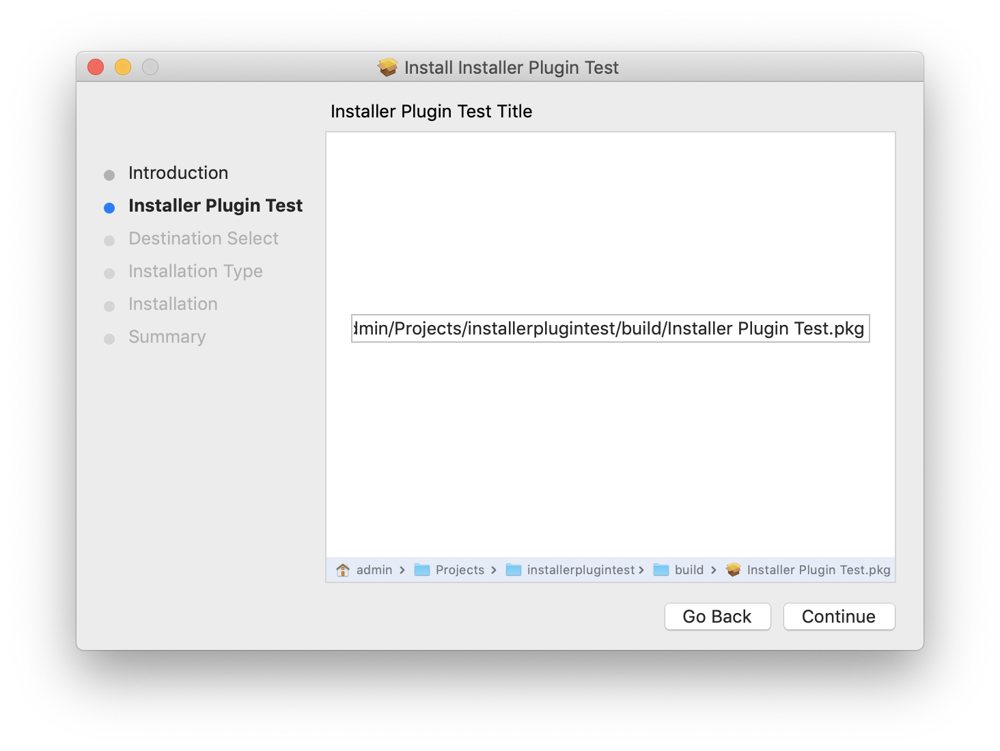

# package-path
InstallerPane category to query the package path.

This should have been a public API in InstallerPane interface.
Since it is not, here is the category to query the package path.

To use, add InstallerPane+VHInstallerPaneMissingMethodAdditions.h and InstallerPane+VHInstallerPaneMissingMethodAdditions.m files to your Installer plug-in project.

This will add 2 new methods to the InstallerPane class:
 
```objective-c
@interface InstallerPane (VHInstallerPaneMissingMethodAdditions)
- (NSString *)packagePath;
- (NSURL *)packageURL;
@end
```
 
and in your InstallerPane subclass file import the header file:
 
```objective-c
#import "InstallerPane+VHInstallerPaneMissingMethodAdditions.h"
```
 
The sample InstallerPluginTest project and InstallerPluginTest package demonstrate the usage.
Works on macOS 10.15 Catalina and previous versions as well.



There a catch though:

On macOS 10.14 or earlier, the package path is queried from the Installer window that is hosting our InstallerPane, so the content view of the InstallerPane should be already added to the window.
On macOS 10.15 Catalina, Installer plug-ins are instantiated in the separate process, so the caller need to wait for the response from the main Installer process. 
This means that the first call to packagePath/packageURL will initiate the query, but will return an empty path until the Installer process responds with the answer.

For that reason, packagePath and packageURL properties are KVO compliant on macOS 10.15 Catalina!
 
```objective-c
- (void)willEnterPane:(InstallerSectionDirection)dir
{
	// the call will not succeed on Catalina because of request roundtrip to another process
	// and on previous versions, because plug-in view is not yet added to the Installer window
    NSLog(@"****** ---%@", self.packagePath);
}

- (void)didEnterPane:(InstallerSectionDirection)dir
{
	// this call will succeed, because the plug-in view already added to the Installer window
    NSLog(@"****** +++%@", self.packagePath);
}

```


